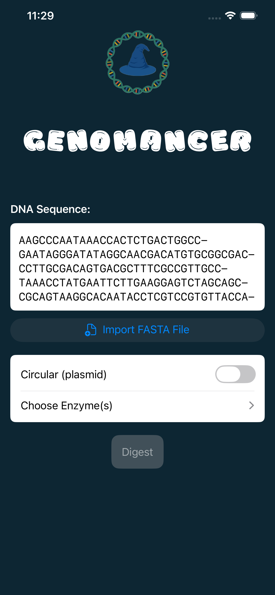
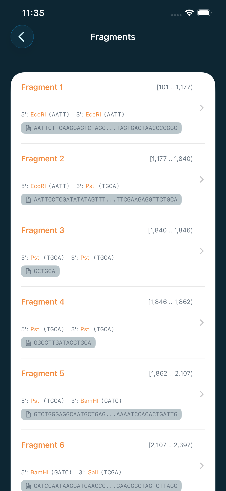
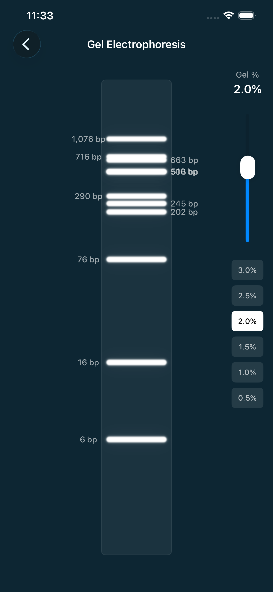
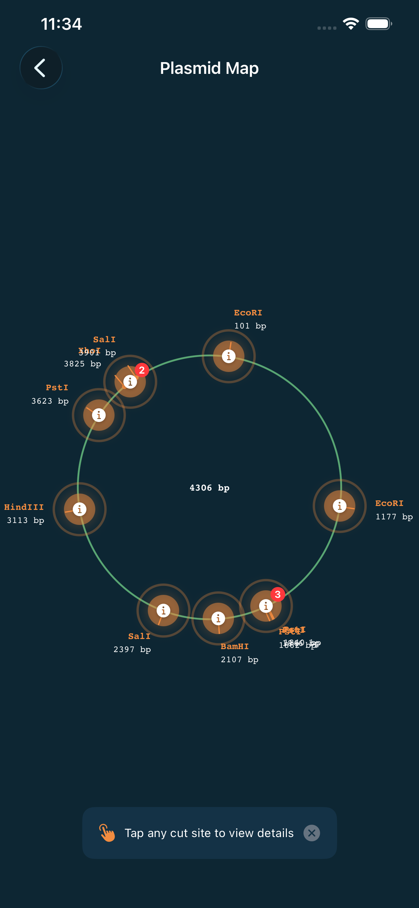

# Genomancer - DNA Restriction Analysis for iOS

  

**Genomancer** is a powerful, elegant iOS app for simulating restriction enzyme digestion of DNA sequences. Whether you're a molecular biology researcher, student, or educator, Genomancer provides professional-grade analysis tools in an intuitive, mobile-friendly interface.

## Features

### 🧬 Comprehensive Restriction Enzyme Analysis
- **350+ Enzyme Database**: Complete library of restriction enzymes with recognition sites, cut positions, and overhang types
- **Linear & Circular DNA Support**: Analyze both linear DNA fragments and circular plasmids
- **Multiple Enzyme Digests**: Select and combine multiple enzymes for complex digest simulations
- **IUPAC Support**: Full support for degenerate base codes (N, R, Y, S, W, K, M, B, D, H, V)

### 📊 Visualization Tools
- **Fragment List**: Detailed view of all DNA fragments with sizes, positions, and end characteristics
- **Gel Electrophoresis Simulation**: Realistic agarose gel visualization showing fragment migration
- **Plasmid Map**: Beautiful circular maps for plasmid digests with labeled cut sites
- **Ligation Compatibility Analysis**: Analyze which fragment ends can be ligated together

### 🎯 Powerful Analysis Features
- **Fragment Sequences**: View exact DNA sequences for each fragment with overhang information
- **Overhang Analysis**: Detailed information about 5' overhangs, 3' overhangs, and blunt ends
- **Cut Site Details**: Complete information about recognition sites and cut positions
- **Wrap-Around Fragments**: Correct handling of circular DNA fragments that span the origin

### 📁 Flexible Input Options
- **FASTA Import**: Import DNA sequences directly from FASTA files
- **Manual Entry**: Type or paste sequences directly into the app
- **Format Detection**: Automatic detection and parsing of FASTA format
- **Sequence Validation**: Real-time validation of DNA sequence characters

## Screenshots

  
  
  
  

  
  

## How to Use

### Basic Workflow

1. **Enter Your DNA Sequence**
   - Type or paste your sequence directly
   - Import a FASTA file using the "Import FASTA File" button
   - Supports both raw sequences and FASTA format with headers

2. **Select Topology**
   - Toggle "Circular (plasmid)" ON for circular DNA (plasmids, viral genomes)
   - Leave OFF for linear DNA (PCR products, genomic fragments)

3. **Choose Restriction Enzymes**
   - Tap "Choose Enzyme(s)" to browse the enzyme database
   - Search for specific enzymes by name
   - Select multiple enzymes for double or triple digests
   - View selected enzymes as chips with easy removal

4. **Run the Digest**
   - Tap the "Digest" button to perform the analysis
   - Wait for results to be calculated

5. **Explore Results**
   - **View Fragments**: See all generated fragments with detailed information
   - **View Map**: Circular plasmid map showing cut sites (circular DNA only)
   - **View Gel**: Simulated agarose gel electrophoresis
   - **Ligation Analysis**: Check which fragment ends are compatible for ligation

### Example Use Cases

#### Verifying a Plasmid Digest
1. Import your plasmid sequence (e.g., pUC19)
2. Enable "Circular (plasmid)" mode
3. Select restriction enzymes (e.g., EcoRI, BamHI)
4. Run digest and check fragment sizes match expected results

#### Planning a Cloning Strategy
1. Enter your insert and vector sequences
2. Test different enzyme combinations
3. Use Ligation Analysis to verify compatible ends
4. Check the gel simulation to predict band patterns

#### Teaching Molecular Biology
1. Import example sequences
2. Demonstrate restriction digests with different enzymes
3. Show students gel migration patterns
4. Explain overhang types and ligation compatibility

## Detailed Features

### Fragment Analysis
Each fragment includes:
- **Position**: Start and end coordinates (0-based indexing)
- **Length**: Fragment size in base pairs
- **Sequence**: Complete DNA sequence (5' to 3')
- **Boundaries**: Which enzymes created each end
- **Overhang Type**: 5' overhang, 3' overhang, or blunt
- **Overhang Sequence**: Exact bases in sticky ends

### Ligation Compatibility
The ligation analysis tool checks:
- **Overhang Compatibility**: Whether two ends have matching sticky sequences
- **Overhang Type Matching**: Both ends must be 5' or both 3'
- **Directionality**: Identifies non-palindromic overhangs for directional cloning
- **GC Content**: Calculates GC% of overhang sequences
- **Melting Temperature**: Estimates Tm using Wallace rule

### Gel Simulation
Realistic gel electrophoresis simulation featuring:
- **Size-Based Migration**: Fragments migrate based on molecular weight
- **Agarose Percentage**: Optimized for different size ranges
- **DNA Ladder**: Standard marker for size comparison
- **Band Intensity**: Visual representation of DNA concentration
- **Circular DNA Forms**: Shows supercoiled (SC) and open circular (OC) forms

### Plasmid Map
Beautiful circular maps showing:
- **Cut Site Markers**: Radial lines indicating restriction sites
- **Position Labels**: Base pair positions for each cut
- **Enzyme Names**: Clear labeling of which enzyme cuts where
- **Tick Marks**: Scale indicators every 1000 bp
- **Multiple Cuts**: Visual indication when multiple enzymes cut at same position

## Enzyme Database

Genomancer includes a comprehensive database of **350+ restriction enzymes**, including:

### Common Enzymes
- **EcoRI** (G^AATTC) - 5' overhang, 4 bp
- **BamHI** (G^GATCC) - 5' overhang, 4 bp
- **HindIII** (A^AGCTT) - 5' overhang, 4 bp
- **PstI** (CTGCA^G) - 3' overhang, 4 bp
- **NotI** (GC^GGCCGC) - 5' overhang, 4 bp
- **EcoRV** (GAT^ATC) - Blunt end

### Enzyme Categories
- **Type II Enzymes**: Standard restriction enzymes with palindromic recognition sites
- **Type IIS Enzymes**: Cut outside their recognition sequence (e.g., BsaI, BsmBI)
- **Blunt Cutters**: Produce blunt ends (e.g., SmaI, EcoRV)
- **4-Base Cutters**: Frequent cutters (e.g., TaqI, MseI)
- **6-Base Cutters**: Standard molecular biology enzymes
- **8-Base Cutters**: Rare cutters (e.g., NotI, AscI)

Each enzyme entry includes:
- Recognition sequence (with IUPAC support)
- Cut position index
- Overhang type (5', 3', or blunt)
- Common usage notes

## Technical Details

### System Requirements
- **iOS 16.0 or later**
- Compatible with iPhone and iPad
- Optimized for all screen sizes
- Supports Dark Mode
- VoiceOver accessible

### Architecture
- Built with **SwiftUI** for modern, responsive UI
- **DigestCore** Swift package for enzyme calculations
- Native performance with no external dependencies
- Efficient handling of large sequences (tested up to 50 kb)

### Sequence Handling
- **Maximum Length**: Tested with sequences up to 50,000 bp
- **Format Support**: Raw sequences and FASTA format
- **Character Validation**: Real-time validation of IUPAC codes
- **Memory Efficient**: Lazy loading and optimized fragment storage

### Enzyme Matching Algorithm
- **IUPAC Expansion**: Full support for degenerate bases
- **Overlapping Sites**: Correctly handles overlapping recognition sequences
- **Cut Position Calculation**: Precise positioning including Type IIS enzymes
- **Circular Wrap-Around**: Correct fragment calculation across origin

## Privacy & Data

**Genomancer respects your privacy:**
- ✅ No data collection
- ✅ No analytics or tracking
- ✅ No internet connection required
- ✅ All processing happens locally on your device
- ✅ Your sequences never leave your iPhone/iPad

## Support & Feedback

### Having Issues?
- Check that your sequence contains only valid IUPAC DNA codes (A, T, C, G, N, R, Y, S, W, K, M, B, D, H, V)
- Ensure you've selected at least one enzyme before digesting
- For circular DNA features, make sure "Circular (plasmid)" toggle is enabled
- Try reimporting FASTA files if sequence isn't recognized

### Contact
- **Email**: flavorislab@gmail.com

### Contributing
We welcome contributions:
- Bug fixes and improvements
- New enzyme additions
- Feature requests and ideas
- Documentation improvements

## FAQ

### Q: Can I use my own enzyme database?
**A:** Currently, the app uses the built-in enzyme database.

### Q: What's the difference between circular and linear mode?
**A:** Circular mode treats the DNA as a closed loop (like a plasmid), which affects fragment calculation. In circular DNA with 2+ cuts, the last fragment wraps around from the end back to the beginning. Linear mode treats DNA as having distinct ends.

### Q: Why do I see "wrap-around" fragments?
**A:** In circular DNA (plasmids), if there are multiple restriction sites, one fragment will span from the last cut site, around position 0, back to the first cut site. This is biologically accurate for circular molecules.

### Q: Can I export my results?
**A:** Results can be viewed and analyzed within the app. Export functionality (CSV, GenBank, images) is planned for future updates.

### Q: Does this replace lab work?
**A:** No! Genomancer is a planning and verification tool. Always confirm computational predictions with actual lab experiments. Enzyme activity can be affected by temperature, buffer conditions, methylation, and other factors not modeled by the app.

### Q: What are the overhang numbers (5', 3', blunt)?
**A:** These indicate the type of DNA ends created:
- **5' overhang**: Top strand extends beyond bottom strand (e.g., EcoRI)
- **3' overhang**: Bottom strand extends beyond top strand (e.g., PstI)
- **Blunt**: Both strands cut at the same position (e.g., SmaI)

### Q: Why can't certain fragments ligate together?
**A:** For ligation, fragments must have:
- Compatible overhang types (both 5' OR both 3')
- Matching overhang lengths
- Complementary sticky-end sequences
- Or both must be blunt ends (with T4 DNA ligase)

## Related Resources

### Scientific Background
- [Restriction Enzymes (Wikipedia)](https://en.wikipedia.org/wiki/Restriction_enzyme)
- [REBASE - The Restriction Enzyme Database](http://rebase.neb.com/)
- [NEB's Restriction Enzyme Resource](https://www.neb.com/tools-and-resources/selection-charts/alphabetized-list-of-recognition-specificities)

### Molecular Biology Tools
- [SnapGene](https://www.snapgene.com/) - Commercial DNA analysis software
- [Benchling](https://www.benchling.com/) - Cloud-based molecular biology platform
- [ApE](https://jorgensen.biology.utah.edu/wayned/ape/) - A plasmid Editor

### Educational Resources
- [Addgene's Plasmid Guide](https://www.addgene.org/protocols/plasmids-101/)
- [NCBI Molecular Biology Resources](https://www.ncbi.nlm.nih.gov/guide/molecular-biology/)

## Acknowledgments

Genomancer is built with:
- **Swift & SwiftUI** - Modern iOS development
- **DigestCore** - Custom Swift package for DNA analysis
- **NEB REBASE** - Enzyme database information

## Version History

### Version 1.0 (Current)
- Initial release
- 350+ enzyme database
- Linear and circular DNA support
- Fragment analysis
- Gel simulation
- Plasmid map visualization
- Ligation compatibility analysis
- FASTA file import
- Dark mode support
- Accessibility features

---

**Made with 🧬 for molecular biologists everywhere**